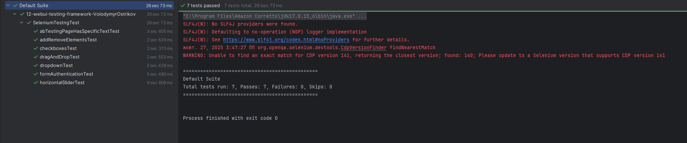
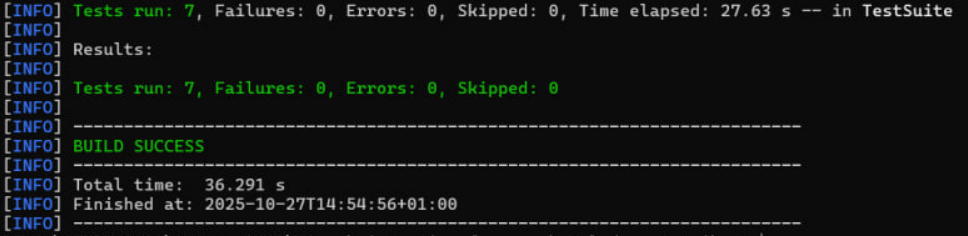

Початок виконання тестування:
1. На комп'ютері має бути встановлено: IntelliJ IDEA,JAVA, MAVEN, SELENIUM, TESTNG.
2. Зклонуй репозиторій https://github.com/JAVA-QA-AUTO-UA-RB/12-webui-testing-framework-VolodymyrOstrikov.git
3. Відкрий його в IntelliJ IDEA.
4. Знайди файл `SeleniumTestngTest.java`.
5. Виконай Run`SeleniumTestngTest`.
6. Очікований результат виконання тесту: .

7.Виконай Maven build за допомогою терміналу, відкрий термінал у папці з проектом та введи:
   ```bash
   mvn clean test
   ```
8. Результат успішного Maven build виглядає так: .